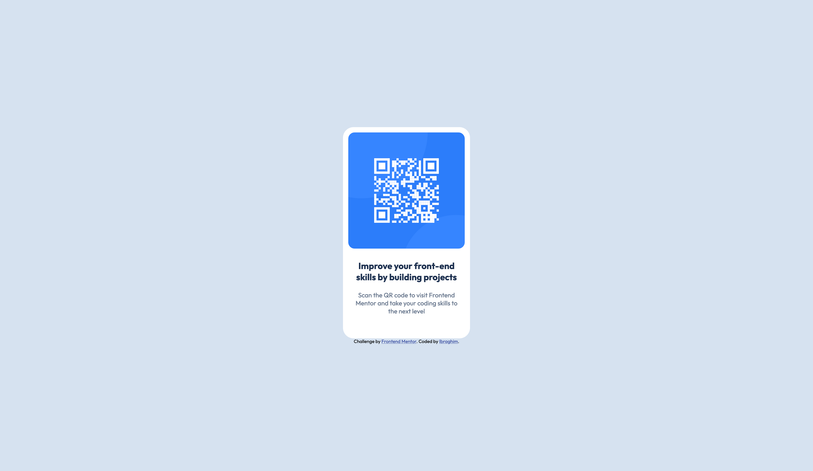

# Frontend Mentor - QR code component solution

This is a solution to the [QR code component challenge on Frontend Mentor](https://www.frontendmentor.io/challenges/qr-code-component-iux_sIO_H). Frontend Mentor challenges help you improve your coding skills by building realistic projects. 

## Overview

I was tasked with building a responsive QR code component based on a design provided by Frontend Mentor. The challenge was to create a reusable card-like element that not only displayed the QR code but also included a brief text underneath. The focus was on making the design fully responsive, ensuring it looked clean and structured across all screen sizes.

### Screenshot

### Links

- Live Site URL: [Challenge Link](https://soy-ibrag.github.io/Frontend-Mentor-QR-Code-Challenge/)

### Built with

- Semantic HTML5 markup
- CSS custom properties
- Flexbox

### What I learned

This project helped me deepen my understanding of the following:
  - Semantic HTML5: I used meaningful HTML tags to improve both the structure and accessibility of the page.
  - CSS Flexbox: Flexbox was key to making the component layout responsive and easy to center on the page.

This was a great exercise to solidify my understanding of responsive design principles and basic component-based design.

### Continued development

In future projects, I want to continue improving on:
  - Advanced CSS layouts: Exploring more complex techniques such as CSS Grid and mastering Flexbox even further.
  - Accessibility: Ensuring that all my projects follow accessibility best practices.

## Author

- Frontend Mentor - [@Soy-Ibrag](https://www.frontendmentor.io/profile/Soy-Ibrag)
- GitHub - [@Soy-Ibrag](https://github.com/Soy-Ibrag)

## Acknowledgments

A big shoutout to @luqmanx1998 for providing helpful resources and support during this challenge!